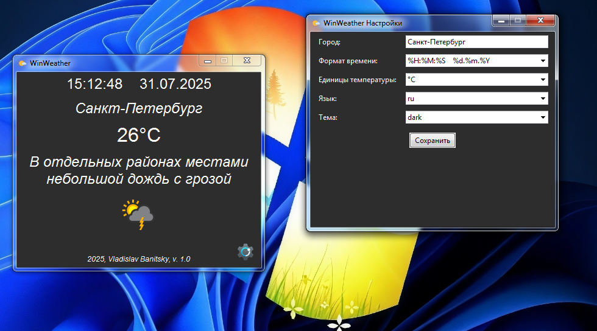

Meet a simple and convenient weather viewing application for Windows! During rain or thunderstorms, the sound of these natural phenomena is turned on. Download, run (without installation), configure and enjoy :)


## How to build .exe
```bash
pip install auto-py-to-exe
auto-py-to-exe
```
Specify the script, icons, and other settings
