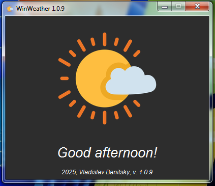
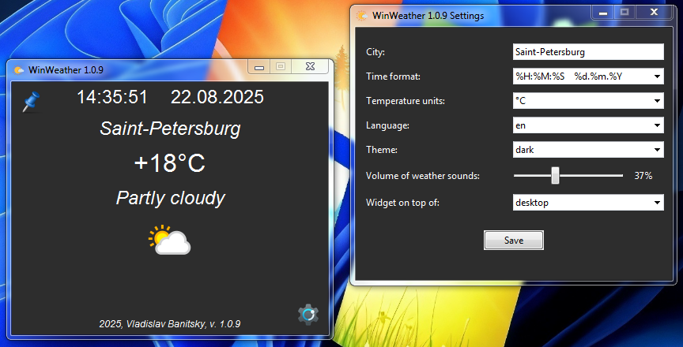
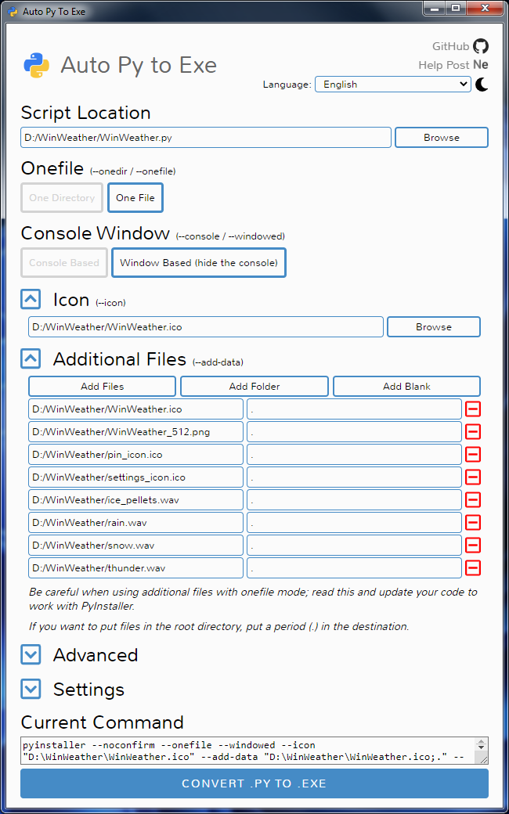

# Welcome to WinWeather community!!!
Meet a simple and convenient weather viewing application for Windows! During rain, thunderstorms, snow, or hail, the sound of these natural phenomena is turned on. Download, run (without installation), configure and enjoy :)

## Light Theme
<div align="center">
   
</div>

## Dark Theme
<div align="center">
   
</div>

## Auto Theme

A light theme in the morning and afternoon and a dark theme in the evening and at night, which turn on automatically.


<div align="center">
  
</div>

## Widget mode

Minimalism is our everything, therefore, a minimalistic widget is provided that is superimposed on top of all windows or only on top of the desktop and positioned anywhere on the screen by simply dragging the left mouse button. A pin button is provided to switch to widget mode and back.


<div align="center">
   
</div>

## Supported languages
Russian and English languages are supported.
If you want, you can help with the translation of WinWeather into your language.

## Automatic location detection
To accurately determine the weather data, it is necessary to know the location with accuracy to the area. The IP address definition is used for this purpose. After the first change of the settings, the location specified by the user in the City field will be applied. To start the default location detection and reset all settings, you can delete the ```settings.json``` file.

## How to build .exe
```bash
pip install auto-py-to-exe
auto-py-to-exe
```
Specify the script, icons, and other settings.
<div align="center">
  
</div>
