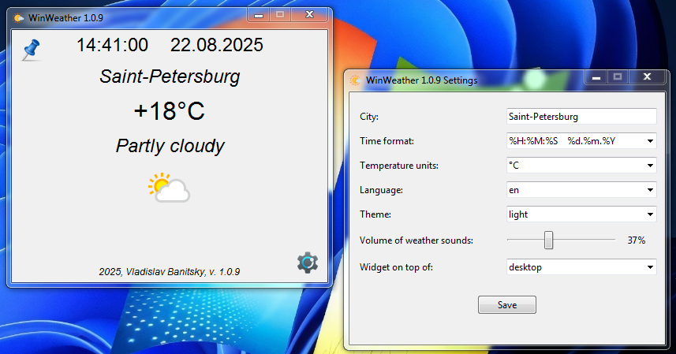

# Welcome to WinWeather community!!!
Meet a simple and convenient weather viewing application for Windows! During rain, thunderstorms, snow, or hail, the sound of these natural phenomena is turned on. Download, run (without installation), configure and enjoy :)
## Light Theme

## Dark Theme

## Supported languages
Russian and English languages are supported.
If you want, you can help with the translation of WinWeather into your language.
## How to build .exe
```bash
pip install auto-py-to-exe
auto-py-to-exe
```
Specify the script, icons, and other settings.
