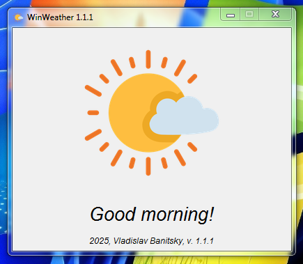
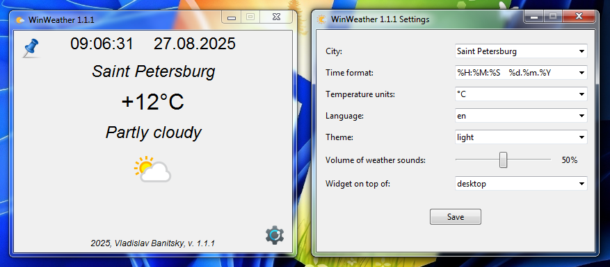
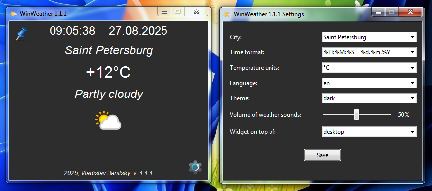

# Welcome to WinWeather community!!!
Meet a simple and convenient weather viewing application for Windows! During rain, thunderstorms, snow, or hail, the sound of these natural phenomena is turned on. Download, run (without installation), configure and enjoy :)

## Snow at the desktop (NEW!)
If you want to decorate your desktop for the New Year, you can enable snow in the settings and beautiful snow will start falling on your desktop.

<div align="center">
  
</div>

## Light Theme
<div align="center">
   
</div>

## Dark Theme
<div align="center">
   
</div>

## Auto Theme

A light theme in the morning and afternoon and a dark theme in the evening and at night, which turn on automatically.

<div align="center">
  
</div>

## Widget mode

Minimalism is our everything, therefore, a minimalistic widget is provided that is superimposed on top of all windows or only on top of the desktop and positioned anywhere on the screen by simply dragging the left mouse button. A pin button is provided to switch to widget mode and back.

<div align="center">
   
</div>

## Minimized mode
Clicking on the arrow button collapses the application into the system tray. Right-clicking on the tray icon opens a context menu from which you can maximize the program window or close it.

<div align="center">
   
</div>

## Supported languages
Russian and English languages are supported.
If you want, you can help with the translation of WinWeather into your language.

## Automatic location detection
To accurately determine the weather data, it is necessary to know the location with accuracy to the area. To do this, the IP address definition is used. The user can leave the location identification by IP address or manually enter the city.

<div align="center">
  
</div>

## If there is no connection
If there is no connection to the weather API or there is simply no Internet connection, a concise error message is provided. Don't be scared, check your Internet connection and if the network is available, just wait, the data will load automatically when the server becomes available.

<div align="center">
   
</div>
<div align="center">
   
</div>

## How to build .exe
```bash
pip install auto-py-to-exe
auto-py-to-exe
```
Specify the script, icons, and other settings.
<div align="center">
  
</div>
